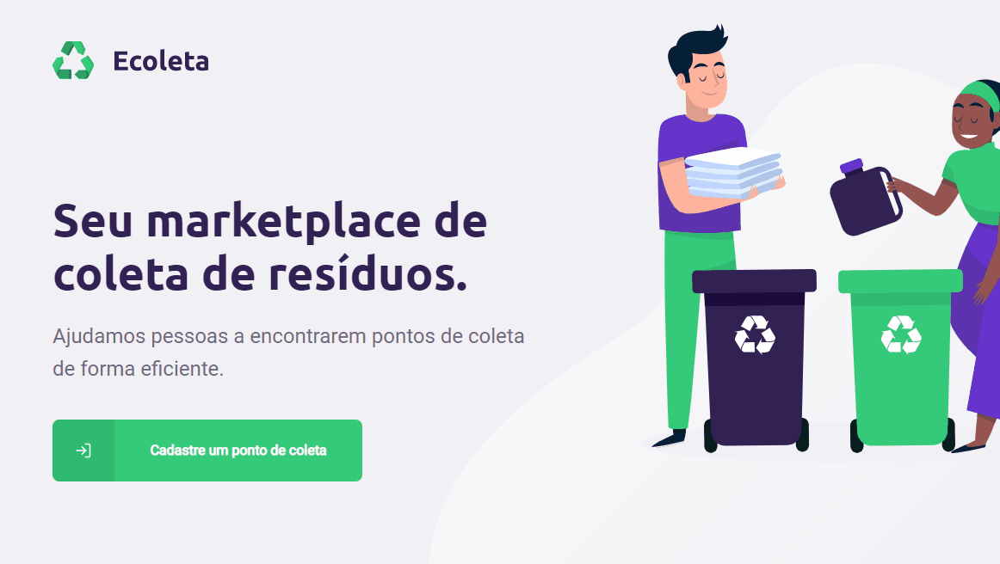

<h1 align="center">
    
    <br>
    <br>
    <a href="https://github.com/fabianoalmeida/next-level-week/tree/master/server">NodeJS</a> + <a href="https://github.com/fabianoalmeida/next-level-week/tree/master/web">ReactJS</a> + <a href="https://github.com/fabianoalmeida/next-level-week/tree/master/mobile">React Native</a>
</h1>

<h4 align="center">
  It's an app for waste collection created during <a href="https://nextlevelweek.com/">Next Level Week #1</a>
  <br>
  Created with :purple_heart: by <a href="https://rocketseat.com.br/">Rocketseat</a>
</h4>

## :video_camera: Demonstration

#### Mobile

<h2 align="center">
  
</h2>

#### Front-end

<h2 align="center">
  
</h2>

## :rocket: Technologies

#### Back-end

-  [npm](https://www.npmjs.com/)
-  [Express](https://expressjs.com/)
-  [Cors](https://github.com/expressjs/cors)
-  [Knex](http://knexjs.org/)
-  [Multer](https://github.com/expressjs/multer)
-  [SQLite](https://www.sqlite.org/)
-  [Typescript][typescript]
-  [Celebrate](https://github.com/arb/celebrate#readme)
-  [VS Code][vc]

#### Front-end

-  [Axios][axios]
-  [Leaflet](https://leafletjs.com/)
-  [React Icons](https://react-icons.github.io/react-icons/)
-  [React Leaflet](https://react-leaflet.js.org/)
-  [React Dropzone](https://react-dropzone.js.org/)
-  [React Router DOM](https://reacttraining.com/react-router/web/guides/quick-start)
-  [Typescript][typescript]
-  [VS Code][vc]

#### Mobile

-  [Axios][axios]
-  [Expo][expo]
-  [Expo Font](https://docs.expo.io/versions/latest/sdk/font/)
-  [Expo Constants](https://docs.expo.io/versions/latest/sdk/constants/)
-  [Expo Location](https://docs.expo.io/versions/latest/sdk/location/)
-  [Expo Vector Icons](https://github.com/expo/vector-icons)
-  [Expo Mail Composer](https://docs.expo.io/versions/latest/sdk/mail-composer/)
-  [React Native](http://facebook.github.io/react-native/)
-  [React Navigation](https://reactnavigation.org/)
-  [React Native SVG](https://github.com/react-native-community/react-native-svg)
-  [React Native Emoji](https://github.com/EricPKerr/react-native-emoji)
-  [React Native Maps](https://github.com/react-native-community/react-native-maps)
-  [React Native Gesture Handler](https://kmagiera.github.io/react-native-gesture-handler/)
-  [VS Code][vc]

## :arrow_forward: Prerequisites

In order to use and test the app on your smartphone, you should've already setup the development environment installing [Expo][expo] or a simulator cause you prefer.
  
## :information_source: How To Use

To clone and run this application, you'll need [Git](https://git-scm.com), [Node.js v12.8][nodejs] or higher, [Expo v3.21][expo] or higher installed on your computer. From your command line:

```bash
# Clone this repository
$ git clone https://github.com/fabianoalmeida/next-level-week next-level-week

# Go into the repository
$ cd next-level-week

# Install back-end dependencies
$ cd server && npm install

# Creating database using knex
$ cd server && npm run knex:migrate

# Seeding database using knex
$ cd server && npm run knex:seed

# Install front-end dependencies
$ cd web && npm install

# Install mobile dependencies
$ cd mobile && npm install

# Run the back-end app
$ cd server && npm run dev

# Run the front-end app
$ cd web && npm start

# Run the mobile app
$ cd mobile && npm start
```

## :memo: License
This project is under the MIT license. See the [LICENSE](https://github.com/fabianoalmeida/next-level-week/blob/master/LICENSE) for more information.

---

Made with :purple_heart: by Fabiano Almeida :wave: [Get in touch!](https://www.linkedin.com/in/fabianobmalmeida/)

[nodejs]: https://nodejs.org/
[axios]: https://github.com/axios/axios
[expo]: https://expo.io/
[vc]: https://code.visualstudio.com/
[typescript]: https://www.typescriptlang.org/